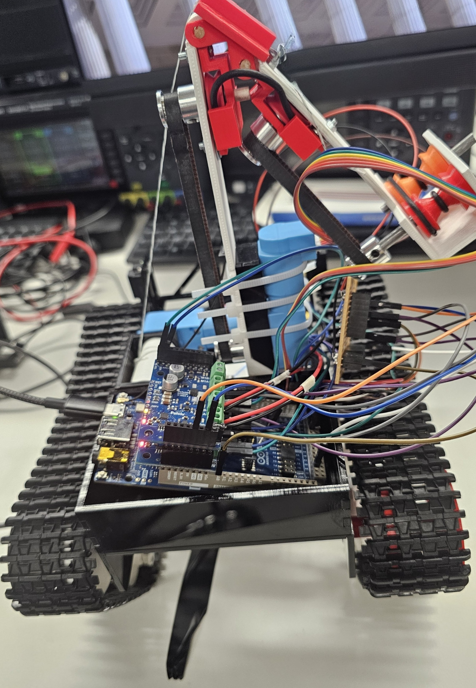

# Rover Controller – Complete How-To Guide

This project documents a **custom robot controller** built for the **Arduino GIGA R1 WiFi**.  
It supports **line following**, **wall following**, and **custom hook-based transitions** using a modular sensor logic framework.

The controller powers *Obsidian – a tracked robot built on the **Black Gladiator Tracked Chassis** from DFRobot – which successfully completed wall-following challenges in the 2025 UCL Robotics competition at UCL East, hosted by the faculty of and hosted for the first year cohort of each year of Robotics and AI students.

---

## Images

| Front View | Side View |
|------------|-----------|
|  |  |

---

## Competition Video

See *Obsidian* in action here:  
[](https://www.youtube.com/watch?v=KxR1-sNMbZ4)

---

## Project Overview

The Rover Controller project is a flexible robotics platform controlled by an Arduino GIGA R1 WiFi board. It supports multiple behaviours through modular sensor logic and configurable PID control.

Sensor logic like QTR and distance readings are handled in dedicated C++ classes such as QTRSensorArray and distance_sensor, which makes modifying behaviour straightforward.

---

## Branch Overview

- **main** -> Actively maintained branch. Supports:
  - Line following with dual QTR sensor arrays
  - Detection of triple lines (used to trigger secondary actions like raising a hook)
  - Transition-ready behaviour (can expand for additional missions)

- **dist** -> Contains wall following and cornering behaviour using 5 IR distance sensors. To use it, you must upload to the robot with this branch’s code.

- **line**, **test**, **obst** -> Deprecated. Legacy logic used in earlier development.

---

## Hardware Requirements

- **Controller:** Arduino GIGA R1 WiFi
- **Motor Drivers:** 2x Pololu Motoron I2C (stacked with AVIN and VM bridged on the top shield)
- **QTR Sensors:** 9-sensor arrays (left and right)
- **Distance Sensors:** 5x Sharp IR analog sensors (mounted left-back, left-front, centre, right-front, right-back)
- **Motors:** 2 DC motors
- **Hook:** Optional mechanism for traversing ziplines etc.
- **Power:** Battery pack (10.905V) and the battery pack connector
- **Chassis and wiring**

---

## Wiring Summary

| Component           | Pins                       |
|--------------------|----------------------------|
| QTR Left            | Digital 40–48              |
| QTR Right           | Digital 24–32              |
| QTR LEDs            | Pins 22 (right), 38 (left) |
| Distance Sensors    | Analog A2–A6               |
| Button              | Digital 23 (pull-up input) |
| Motoron Controllers | I2C0 and I2C1 (Wire and Wire1) |

---

## Software Setup

1. Install the Arduino IDE.
2. Open the `rover_controller.ino` file from the `main` or `dist` branch.
3. Select the Arduino GIGA R1 WiFi board.
4. Upload the sketch over USB.
5. Open the Serial Monitor at 115200 baud to view sensor and debug info.

To switch between line and wall following, you must manually switch to the relevant branch (`main` or `dist`) and upload it to the robot. The robot does not auto-switch between behaviours.

---

## Code Architecture

### Modules
- `distance_sensor.cpp/h`: IR sensor smoothing, validation, and distance calculation
- `pid_controller.cpp/h`: General-purpose PID logic, reusable for angle and position control
- `QTRSensorArray.cpp/h`: Manages raw and normalised sensor readings
- `wifi_logic.cpp/h`: Sends or receives UDP messages for stop control (optional)

For example, pid_controller.h is completely independent and reusable — you can swap it into a different robot without changes.

---

## Robot Behaviour (Main Branch)

When using the `main` branch, the robot performs line following using two 9-sensor QTR reflectance arrays. The flow of behaviour includes:

1. **Sensor Sampling**: Every 10 ms, both arrays read reflectance values across their 9 sensors. This gives a rough picture of how the robot sits over the line.

2. **Preprocessing**: The raw values are normalised based on earlier calibration runs so they sit between 0 and 1000. This makes thresholding and line position estimation easier.

3. **Sensor Order Fixes**: One of the sensor arrays might be flipped depending on how it’s mounted. The readings from that side get reversed in software to match the layout.

4. **Line Position Estimate**: Each normalised value is multiplied by a weight and summed up to get a position index, usually ranging from 0 (far left) to 8000 (far right). Think of this like finding the centre of mass of the black area.

5. **PID Logic**: The error (difference between desired and actual line position) is passed into a PID controller. This outputs a correction term.

6. **Motor Updates**: The correction affects how fast each wheel spins. One slows down, one speeds up, so the robot steers back onto the line.

7. **Transition Logic**: When a triple line is detected, the robot pauses or does a defined action. The default setup assumes you might raise a hook using the third DC motor.

---

## Robot Behaviour (dist Branch)

The `dist` branch is built for wall following and corner detection using 5 IR distance sensors. It doesn’t use the QTR sensors at all.

1. **Sensor Readings**: Sensors mounted on the left-back, left-front, centre, right-front, and right-back take readings every 10 ms. These analog voltages are converted to distance using a calibrated equation.

2. **Filtering**: To reduce noise, each sensor’s output goes through exponential smoothing and is also stored in a moving average buffer.

3. **Value Protection**: To protect from corruption of the averaging vector we are pushing to and reading means from, if the voltage read is nan or inf or the same for the distance or if the distance is not in range, we do not push this value to the average, and we reset the average to 0.0. Furthermore since the minimum distance pushed is above 0 we know that when the mean returns 0 that the sensor in question has received bad data (e.g. too far from any walls to detect anything).

4. **Distance and Angle Errors**:
   - **Distance Error**: How far the robot is from the wall on its left, compared to `TARGET_DISTANCE`
   - **Angle Error**: Difference between left-front and left-back sensors. This tells you if the robot is skewed

5. **Two PID Loops**: One PID deals with lateral distance, the other with angular misalignment. Their outputs are mixed into motor speed commands.

6. **Corner Detection**: The front centre sensor checks for an object directly ahead. If the robot is not angled toward or away from the wall (angle error is low) and still sees something ahead, it concludes it’s reached a corner.

7. **Corner Handling**: The robot stops, backs up slightly, does an in-place turn (usually 90°), and waits until it’s clear to resume wall following. The behaviour can be tuned by adjusting delay durations and angle tolerances.

This system is flexible. You can tweak PID gains, change the corner detection logic, or swap sensor roles in the source code.

---

## Customising Behaviour

Here are some quick ways to tweak the robot:

### Tune PID Response
```cpp
PIDController pid(1.10, 0.10, 0.05);
```
Edit the numbers to change how aggressively it corrects error. Use `.reset()` before switching between PID modes.

### Adjust Line Detection
- `line_threshold`: Raw value cutoff for deciding if a sensor sees black (default: 200)
- `confidence`: Float between 0–1. How black a region has to be before it’s seen as a wide marker

### Add Behaviour When Detecting a Wide Line
```cpp
if (qtrL.isLineDetected(0.5) && qtrR.isLineDetected(0.5)) {
    hook.activate();
    delay(1000);
    hook.deactivate();
}
```
Replace `hook.activate()` with any custom logic you want.

### Switch to Wall Following
If you want the robot to follow walls instead of lines:
```bash
git checkout dist
```
Then flash the new firmware.

- Adjust `TARGET_DISTANCE` to set the ideal wall gap
- Tune `Kp`, `Ki`, `Kd` values for both distance and angle PID controllers
- You can also modify corner handling logic for tighter or slower turns

**Important**: The robot only runs one type of behaviour at a time. Switching between line and wall following requires flashing the robot with code from the correct branch.

---

## Calibration Tips

### Line Sensors

Use the `.calibrate_time(ms)` method to automatically detect min/max sensor values:

```cpp
qtrL.calibrate_time(3000);
qtrR.calibrate_time(3000);
```

Calibrate by smoothly moving robot back and forth across a black line on the surface you wish to traverse, perpendicular to the line.

### Distance Sensors

Distance sensors already apply exponential smoothing and only push valid values to their average buffer. No additional calibration is needed at program start.

---

## License
MIT License

---

## Author
**Kishan Grewal**  
GitHub: [github.com/kishan-grewal](https://github.com/kishan-grewal)

---

Originally developed for a term project, but it’s modular enough to build on for competitions or personal experiments.
